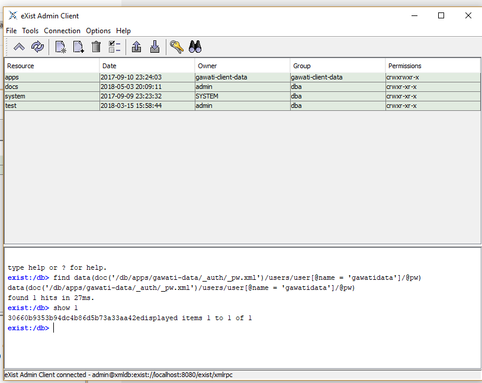

Gawati as a local installation
##############################

.. note:: 
  To access instructions for Gawati Portal v1 see `here <./dev-env-local-v1>`_

The below instructions are not specific to an operating system, the components will run on different operating systems.

.. note::
  Pre-requisites:
    1. JDK - On Linux operating systems you can install `OpenJDK8 <http://openjdk.java.net/install/>`_; For `Windows <https://docs.oracle.com/javase/8/docs/technotes/guides/install/windows_jdk_install.html#CHDEBCCJ>`_ and for `Mac OSX <https://docs.oracle.com/javase/8/docs/technotes/guides/install/mac_jdk.html#CHDBADCG>`_ and `Using OS X Homebrew <https://stackoverflow.com/questions/24342886/how-to-install-java-8-on-mac/28635465#28635465>`_
    2. NodeJS - See`NodeJS LTS 8.9.x <https://nodejs.org/en/download/>`_. Alternatively you can install NVM (for `Linux <https://github.com/creationix/nvm/>`_ , `Windows <https://github.com/coreybutler/nvm-windows>`_ ) which lets you easily install parallel versions of NodeJS. 

The installation items are listed below:

  1. eXist-db: Download and install eXist-db, see `eXist-db <https://bintray.com/existdb/releases/exist/3.6.0/view>`_ Remember to note down the admin password of the eXist-db installation, you will need that later.
  2. Ant: Download and `install Ant <http://ant.apache.org/manual/install.html#installing>`_ 
  3. Apache: Install Apache, on Cent OS, Ubuntu and OS X this will likely be installed by default, on Windows you will have to download and install, see `Apache for Windows <https://www.apachehaus.com/cgi-bin/download.plx>`_; enable `mod_alias`, `mod_rewrite`, `mod_proxy`, `mod_proxy_http` and enable htaccess.
  4. Visual Studio Code: This is if you want play around with gawati code. Download, and setup Visual Studio Code (there are versions for Windows, OS X and Linux) for development, see :doc:`VS Code Setup <./using-vscode>`_

You can either build the source from github for each component, or you can install a released version of a component. For getting familiar with the system we recommend starting by installing a released version.

.. contents:: :local:

*********************
Installing components
*********************
.. note::
  .. include:: version-info.rst
  .. include:: download-links.rst

Installing Gawati Data and Gawati Data XML
==========================================

.. note::
  .. include:: note-gawati-data.rst

Place #3,#4 files in the `autodeploy` folder within the eXist installation, and restart the eXist database server. 
They will be automatically installed.

Load Sample Data
----------------
.. note::
  The sample data is currently at version 1.2

To understand better how gawati works, we provide you with sample data, which can be loaded into the system and tested. Sample data is provided in two specific parts:

 * Xml Documents - which get loaded into the XML database (i.e. into *Gawati Data XML*) 
 * PDF and other binary Documents - which are refered to by the XML documents, but served from the *file system*

We serve PDF and other binary documents from the filesystem to ensure optimal performance.

Download the data sets
----------------------

Download the `XML Data set`_ and the corresponding `PDF Data set`_

Setup the PDF data set
----------------------

To setup the PDF data-set, you just need to extract the files into a folder, e.g if you extract the PDF files into `/home/data/akn_pdf`, and add a Apache configuration to serve the folder contents (See line 7 below `Add the Apache configuration for binary data`_)

Setup the XML data set
----------------------

To setup the XML data-set, extract the archive into a separate folder. On Linux and MacOS you can run the following command to get the data input password:

.. code-block:: bash
  :linenos:

  <path_to_exist>/bin/client.sh -ouri=xmldb:exist://localhost:8080/exist/xmlrpc -u admin -P <exist_admin_password> -x "data(doc('/db/apps/gw-data/_auth/_pw.xml')/users/user[@name = 'gwdata']/@pw)"

Where `<path_to_exist>` is the path to the eXist-db installation, and `<exist_admin_password>` is the eXist-db admin password. If you installed eXist on a different port change that in the `-ouri` setting.

On Windows do the following; Start the eXist-db Client(`<path_to_exist>/bin/client.bat`). In the command window of the eXist-db client run the following commands:

.. code-block:: none
  :linenos:

  find data(doc('/db/apps/gw-data/_auth/_pw.xml')/users/user[@name = 'gwdata']/@pw)
  show 1

Copy the output password hash as shown below.

Now upload the data using the following command run from the eXist-db folder:

.. code-block:: bash
  :linenos:

  ./bin/client.sh -u gwdata -P <copied_password_hash> -d -m /db/apps/gw-data/akn -p /home/data/akn_xml/akn

On Windows you will run it as :samp:`.\\bin\\client.bat` instead:

.. code-block:: bash
  :linenos:

  .\bin\client.bat -u gwdata -P <copied_password_hash> -d -m /db/apps/gw-data/akn -p d:\data\akn_xml\akn

Add the Apache configuration for binary data
--------------------------------------------

The Apache configuration will allow accessing gawati data server services over a web-browser using the URL:

To do this, open the `httpd.conf` (or equivalent) file of your apache installation and add the following:

.. code-block:: apacheconf
  :linenos:

    Alias /akn "/home/data/akn_pdf"
    <Directory "/home/data/akn_pdf">
      Require all granted
      Options Includes FollowSymLinks
      AllowOverride All
      Order allow,deny
      Allow from all
    </Directory>

Add the Apache configuration for gawati data services
-----------------------------------------------------

The services provided by *Gawati Data* to access the XML documents in Gawati are not directly exposed to the outside, they are reverse proxied using Apache. The full configuration of apache config entries is provided below: 

.. code-block:: apacheconf
  :linenos:

  <Location "/gw/service/searchac/">
    AddType text/cache-manifest .appcache
    DirectoryIndex "login.html"
    ProxyPass  "http://localhost:8080/exist/restxq/gw/searchAC/json"
    ProxyPassReverse "http://localhost:8080/exist/restxq/gw/searchAC/json"
    ProxyPassReverseCookiePath /exist /
    SetEnv force-proxy-request-1.0 1
    SetEnv proxy-nokeepalive 1
  </Location>

  <Location "/gw/service/pdf/">
    AddType text/cache-manifest .appcache
    DirectoryIndex "login.html"
    ProxyPass  "http://localhost:8080/exist/restxq/gw/doc/pdf"
    ProxyPassReverse "http://localhost:8080/exist/restxq/gw/doc/pdf"
    ProxyPassReverseCookiePath /exist /
    SetEnv force-proxy-request-1.0 1
    SetEnv proxy-nokeepalive 1
  </Location>

  <Location "/gw/service/themes/expressions/summary/">
    AddType text/cache-manifest .appcache
    ProxyPass  "http://localhost:8080/exist/restxq/gw/themes/expressions/summary/json"
    ProxyPassReverse "http://localhost:8080/exist/restxq/gw/themes/expressions/summary/json"
    ProxyPassReverseCookiePath /exist /
    SetEnv force-proxy-request-1.0 1
    SetEnv proxy-nokeepalive 1
  </Location>

  <Location "/gw/service/recent/expressions/summary/">
    AddType text/cache-manifest .appcache
    ProxyPass  "http://localhost:8080/exist/restxq/gw/recent/expressions/summary/json"
    ProxyPassReverse "http://localhost:8080/exist/restxq/gw/recent/expressions/summary/json"
    ProxyPassReverseCookiePath /exist /
    SetEnv force-proxy-request-1.0 1
    SetEnv proxy-nokeepalive 1
  </Location>

  <Location "/gw/service/doc/">
    AddType text/cache-manifest .appcache
    ProxyPass  "http://localhost:8080/exist/restxq/gw/doc/json"
    ProxyPassReverse "http://localhost:8080/exist/restxq/gw/doc/json"
    ProxyPassReverseCookiePath /exist /
    SetEnv force-proxy-request-1.0 1
    SetEnv proxy-nokeepalive 1
  </Location>

  <Location "/gw/portal/xml/">
    AddType text/cache-manifest .appcache
    ProxyPass  "http://localhost:8080/exist/restxq/gw/doc"
    ProxyPassReverse "http://localhost:8080/exist/restxq/gw/doc"
    ProxyPassReverseCookiePath /exist /
    SetEnv force-proxy-request-1.0 1
    SetEnv proxy-nokeepalive 1
  </Location>

  <Location "/gw/service/search/year/">
    AddType text/cache-manifest .appcache
    ProxyPass  "http://localhost:8080/exist/restxq/gw/search/years/summary/json"
    ProxyPassReverse "http://localhost:8080/exist/restxq/gw/search/years/summary/json"
    ProxyPassReverseCookiePath /exist /
    SetEnv force-proxy-request-1.0 1
    SetEnv proxy-nokeepalive 1
  </Location>

  <Location "/gw/service/search/language/">
    AddType text/cache-manifest .appcache
    ProxyPass  "http://localhost:8080/exist/restxq/gw/search/languages/summary/json"
    ProxyPassReverse "http://localhost:8080/exist/restxq/gw/search/languages/summary/json"
    ProxyPassReverseCookiePath /exist /
    SetEnv force-proxy-request-1.0 1
    SetEnv proxy-nokeepalive 1
  </Location>

  <Location "/gw/service/search/keyword/">
    AddType text/cache-manifest .appcache
    ProxyPass  "http://localhost:8080/exist/restxq/gw/search/keywords/summary/json"
    ProxyPassReverse "http://localhost:8080/exist/restxq/gw/search/keywords/summary/json"
    ProxyPassReverseCookiePath /exist /
    SetEnv force-proxy-request-1.0 1
    SetEnv proxy-nokeepalive 1
  </Location>

  <Location "/gw/service/search/country/">
    AddType text/cache-manifest .appcache
    ProxyPass  "http://localhost:8080/exist/restxq/gw/search/countries/summary/json"
    ProxyPassReverse "http://localhost:8080/exist/restxq/gw/search/countries/summary/json"
    ProxyPassReverseCookiePath /exist /
    SetEnv force-proxy-request-1.0 1
    SetEnv proxy-nokeepalive 1
  </Location>

The above assumes:
  * eXist-db is running on port 8080 (if that is not the case in your installation change it appropriately in line 16 and 17)

.. note::
  On Windows the Apache Alias directory path need to use the back slash instead of the standard windows forward slash. For e.g. if the templates are in: `d:\\code\\gawati-templates` then the path in the Apache configuration should be: `d:/code/gawati-templates`

Test if your services are accessible
------------------------------------

Assuming your domain is `localhost`, and you have loaded the data into eXist and started the service, this url accessed via a web browser should return some XML documents to you: `http://localhost/gw/service/recent/expressions/summary`

Installing Gawati Portal Server
===============================

Choose the appropriate folder to install the portal server. 
Extract the downloaded archive into that folder, and then run:

.. code-block:: bash
  :linenos:

  npm install

Installing Gawati Portal UI
===========================

Extract the contents of the zip file onto a directory served by Apache. 
And add the corresponding Apache Server configuration entry. 

For example: if you want to serve the portal from the `/ui` virtual directory of your domain, and your files are located in `/home/web/apps/gawati-portal-ui`, then use the following apache configuration --  

.. code-block:: apacheconf
  :linenos:

    Alias /ui "/home/web/apps/gawati-portal-ui"
    <Directory "/home/web/apps/gawati-portal-ui">	
      DirectoryIndex "index.html"
      Require all granted
      AllowOverride All
      Order allow,deny
      Allow from all
    </Directory>

Installing Gawati Portal Server
===============================

Extract the contents of the zip file into any directory. 
The Gawati Portal has two runnable components, the portal http server which provides access to REST services, and a cron component that runs scheduled tasks periodically. 

Running the REST service
---------------------------

Run the following in the extracted folder to setup the server:

.. code-block:: bash
  :linenos:

  npm install 

Assuming you extracted the portal server into : `/home/web/portal-server`, from that folder, run :

.. code-block:: bash
  :linenos:

  node ./bin/www

To start up the web-service. By default it starts on PORT 9001. You can change that by running it as: 

.. code-block:: bash
  :linenos:

  PORT=11001 node ./bin/www

Add the following Apache entry for it:

.. code-block:: apacheconf
  :linenos:

  <Location "/gw/service/short-filter-cache/">
    AddType text/cache-manifest .appcache
    ProxyPass  "http://localhost:9001/gwp/short-filter-cache"
    ProxyPassReverse "http://localhost:9001/gwp/short-filter-cache"
    ProxyPassReverseCookiePath /exist /
    SetEnv force-proxy-request-1.0 1
    SetEnv proxy-nokeepalive 1
  </Location>

Running the cron service
------------------------

This is started by simply running: 

.. code-block:: bash
  :linenos:
  
  node ./cron.js

.. _gawati-portal-ui: https://github.com/gawati/gawati-portal-ui
.. _gawati-portal-server: https://github.com/gawati/gawati-portal-server
.. _XML Data set: https://github.com/gawati/gawati-data-xml/releases/download/1.2/akn_xml_sample-1.2.zip
.. _PDF Data set: https://github.com/gawati/gawati-data-xml/releases/download/1.2/akn_pdf_sample-1.2.zip
