#################
Developing Gawati
#################

.. contents:: Table of Contents 
  :local:

************
Introduction
************

Gawati is made of different components, you don't need to install the full set to begin developing on the Gawati platform.  This section provides an outline of how you can use and individual components.

.. note::
  If you only wish to install and test the system, See :doc:`Setup <../setup/index>`.

****************
Getting Started
****************

You will need to setup the basics first.

Prepare your development environment installing and running Gawati as local services on your development system (this document provides you with additional insight).
Alternatively, use a prebuilt VM and Gawati installer to run Gawati as a virtual machine (this document gets you a standardised environment fast).

.. toctree::
   :maxdepth: 1

   dev-env-local
   dev-env-vm

********************
Development Workflow
********************

The standard development cycle is as follows:
  1. clone the projects from github
  2. build the projects where necessary (`gawati portal`_, `gawati data`_, `gawati data xml`_)
  3. deploy onto apache (`gawati templates`_) and;
  4. deploy onto eXist-db (`gawati portal`_, `gawati data`_, `gawati data xml`_)

Code for `gawati templates`_ is directly edited and committed from the filesystem.

Code for eXist-db packages requires an additional step. You will need to export the database onto the file-system and then merge it into your github clone folder:

  .. figure:: ./_images/exist-backup.png
   :alt: eXist backup
   :align: center
   :figclass: align-center

The database contents get exported to the file system:

  .. figure:: ./_images/exist-backup-export.png
   :alt: eXist backup exported to file system
   :align: center
   :figclass: align-center

In the image the exported `gawati portal`_ folder is selected. You will need to compare this folder with the git cloned folder on your file system using a tool like `WinMerge`_(on Windows) or `Meld`_(on Linux) or `Meld OS X`_, and merge the changed files. After which you can commit your changes.

*************************
Building code from Github
*************************

We are going to look at 2 components of Gawati:
 - the Gawati-Portal component: Provides a web portal interface to Legal data on Gawati
 - the Gawati-Data component: Provides a REST API to access Gawati documents from the XML database.

The Portal accesses data and documents from the XML database via the Gawati-Data server's REST APIs.

The build process for these components is a trivial one. It merely packages the files into a format expected by eXist-db, and then the packages are deployed on eXist-db.

For example, to deploy Gawati-Data on the eXist-db server, do the following::

  https://github.com/gawati/gawati-data.git
  cd gawati-data

The source code for the Gawati-Data server is in the `gawati-data` folder, you can make code changes there.
Finally package your code::

  ant xar

This will generate a file `gawati-data-X.X.X.xar` in the `./build` folder, which you will install into eXist-db via the Dashboard.

If you have a stock installation of eXist-db, it will be running on port 8080. Access eXist-db on that port via the web-browser. Login as admin, and that should bring you to the page `http://localhost:8080/exist/apps/dashboard/index.html`. In the dashboard click on *Package Manager*:

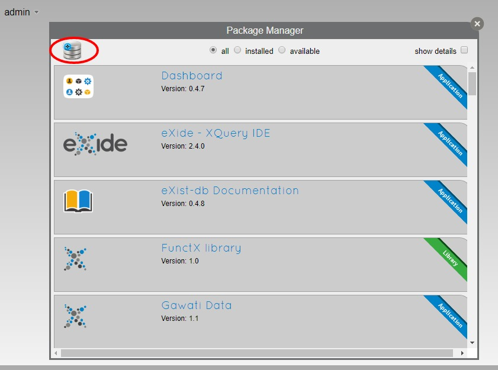

Click the *+* icon, and select the package you just built in the `build` folder and install it into eXist-db. You will find the package accessible via the URL: `eXist gawati data <http://localhost:8080/exist/apps/gawati-data>`

********************
Customizing Gawati
********************
Theming Gawati
------------------
The look and feel of Portal interface can be customized according to certain themes.  
The Portal Interface is available presently in two themes:

1. Default - `default`
2. Kenya - `ke`

A subset of the CSS styles have been extracted into CSS variables.  The variables are defined in `vars.css` files.  A `vars.css` file is available for each theme and contains the styles specific to that theme. `vars.css` and the images used in a theme are present in the `src/css/themes/<theme>` folder.  In order to apply a theme, edit the file `.env`.  Change the value of the `REACT_APP_THEME` variable to the code of the required theme. For eg., to select the Default theme, the `.env` file should read:

`REACT_APP_THEME=default`

The `env.development` file overrides the `.env` file in development mode.  In order to change the theme during development, modifying `env.development` alone will do.

The background, foreground colors for the text content in the top bar, section and footer areas , buttons and other UI controls, logos etc., are customizable.

Default theme
^^^^^^^^^^^^^^^^^^^^^
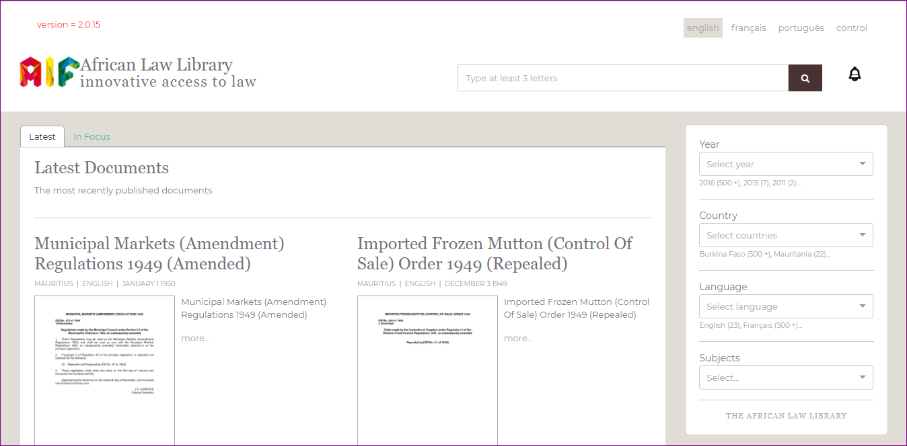

Kenya theme
^^^^^^^^^^^^^^^^^^^^^
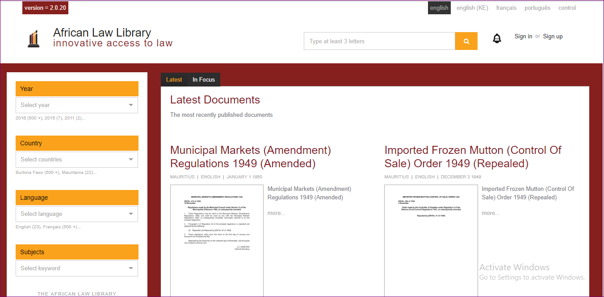

.. _gawati portal: https://github.com/gawati/gawati-portal
.. _gawati data: https://github.com/gawati/gawati-data
.. _gawati data xml: https://github.com/gawati/gawati-data-xml
.. _gawati templates: https://github.com/gawati/gawati-templates
.. _WinMerge: http://winmerge.org/
.. _Meld: http://meldmerge.org/
.. _Meld OS X: https://yousseb.github.io/meld/

Customizable CSS properties
^^^^^^^^^^^^^^^^^^^^^^^^^^^^^

.. raw:: html

  <table style="border-collapse: collapse; border: solid 1px black;">
      
      <thead>
          <tr>
              <th style="border: 1px solid black; text-align:center;">Variable</th>
              <th style="border: 1px solid black; text-align:center;">Affected DOM</th>
              <th style="border: 1px solid black; text-align:center;">Images</th>
          </tr>
      </thead>
      
      <tr>
          <td style="border: 1px solid black; text-align:center;">--overrides-breadcrumb-color</td>
          <td style="border: 1px solid black; text-align:center;">Breadcrumbs text color</td>
          <td style="border: 1px solid black; text-align:center;">

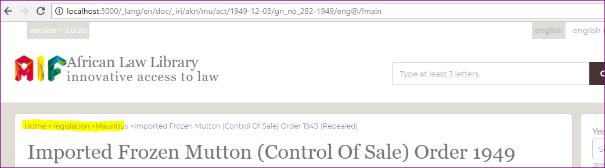

.. raw:: html

              </td>
      </tr>

      <tr>
          <td style="border: 1px solid black; text-align:center;">--overrides-p-color</td>
          <td style="border: 1px solid black; text-align:center;">Overall text color</td>
          <td style="border: 1px solid black; text-align:center;">

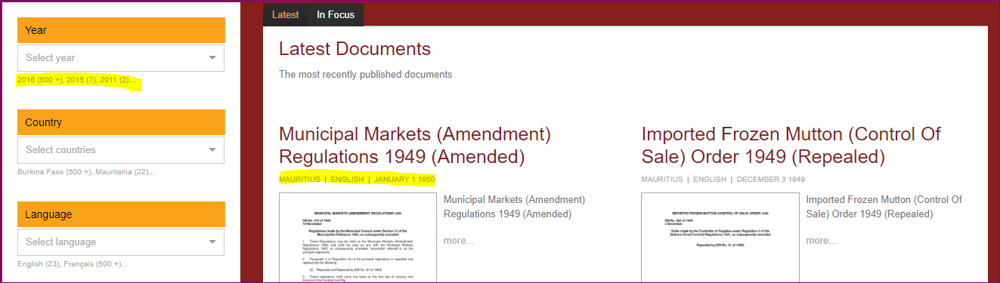

.. raw:: html

              </td>
      </tr>

      <tr>
          <td style="border: 1px solid black; text-align:center;">--overrides-a-color, --overrides-a-focus-color</td>
          <td style="border: 1px solid black; text-align:center;">Font color of links, color when in focus</td>
          <td style="border: 1px solid black; text-align:center;">

.. figure:: ./_images/vars/--overrides-a-color.PNG
  :target: ./_images/vars/--overrides-a-color.PNG
  :alt: --overrides-a-color
  :align: center
  :figclass: align-center

.. raw:: html

              </td>
      </tr>

      <tr>
          <td style="border: 1px solid black; text-align:center;">--overrides-h-color</td>
          <td style="border: 1px solid black; text-align:center;">Font color of headings other than the branding area</td>
          <td style="border: 1px solid black; text-align:center;">

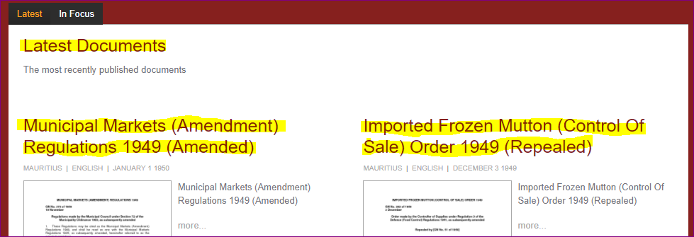

.. raw:: html

              </td>
      </tr>

      <tr>
          <td style="border: 1px solid black; text-align:center;">--font-1</td>
          <td style="border: 1px solid black; text-align:center;">General font-family excluding headings</td>
          <td style="border: 1px solid black; text-align:center;">

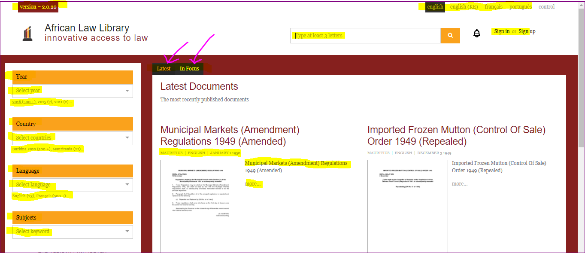

.. raw:: html

              </td>
      </tr>

      <tr>
          <td style="border: 1px solid black; text-align:center;">--font-2</td>
          <td style="border: 1px solid black; text-align:center;">Font family of headings including the branding area</td>
          <td style="border: 1px solid black; text-align:center;">

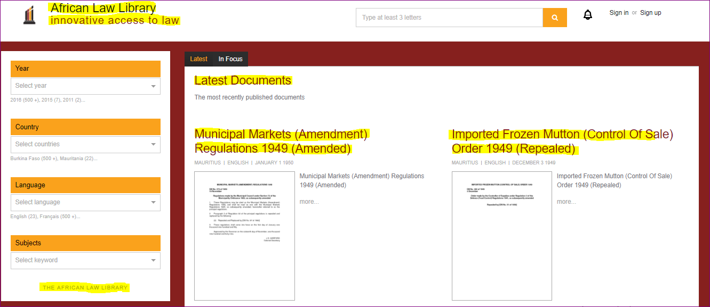

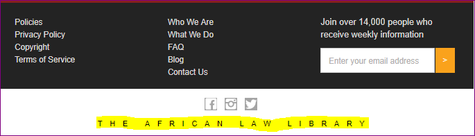

.. raw:: html

              </td>
      </tr>

      <tr>
          <td style="border: 1px solid black; text-align:center;">--font-3</td>
          <td style="border: 1px solid black; text-align:center;">Font family in the auto-suggest area</td>
          <td style="border: 1px solid black; text-align:center;">

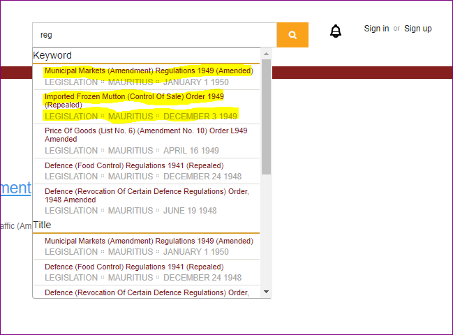

.. raw:: html

              </td>
      </tr>
      
      <tr>
          <td style="border: 1px solid black; text-align:center;">--main-col-position</td>
          <td style="border: 1px solid black; text-align:center;">Position of the main content column - left or right</td>
          <td style="border: 1px solid black; text-align:center;">

.. raw:: html

              </td>
      </tr>

      <tr>
          <td style="border: 1px solid black; text-align:center;">--content-grey-rule-bg-color</td>
          <td style="border: 1px solid black; text-align:center;">Horizontal divider line color</td>
          <td style="border: 1px solid black; text-align:center;">

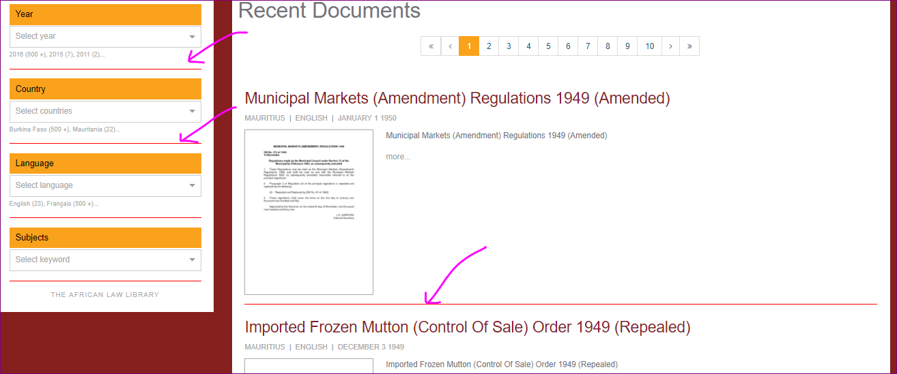

.. raw:: html

              </td>
      </tr>

      <tr>
          <td style="border: 1px solid black; text-align:center;">--content-text-block-color, --content-a-hover-color</td>
          <td style="border: 1px solid black; text-align:center;">Links color and hover color</td>
          <td style="border: 1px solid black; text-align:center;">

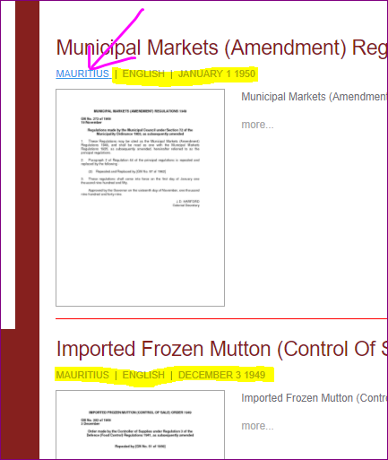

.. raw:: html

              </td>
      </tr>

      <tr>
          <td style="border: 1px solid black; text-align:center;">--content-button-bg-color, --content-button-color</td>
          <td style="border: 1px solid black; text-align:center;">Button colors in the main content column</td>
          <td style="border: 1px solid black; text-align:center;">

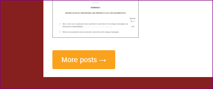

.. raw:: html

              </td>
      </tr>

      <tr>
          <td style="border: 1px solid black; text-align:center;">--content-tab-pane-bg-color</td>
          <td style="border: 1px solid black; text-align:center;">Background color of the tab pane</td>
          <td style="border: 1px solid black; text-align:center;">

.. raw:: html

              </td>
      </tr>

      <tr>
          <td style="border: 1px solid black; text-align:center;">--content-search-result-bg-color, --content-search-result-box-shadow, --content-search-result-color, --content-search-result-h1-color</td>
          <td style="border: 1px solid black; text-align:center;">Styles the main content column(Figure shows the region in yellow) in the search pages.</td>
          <td style="border: 1px solid black; text-align:center;">

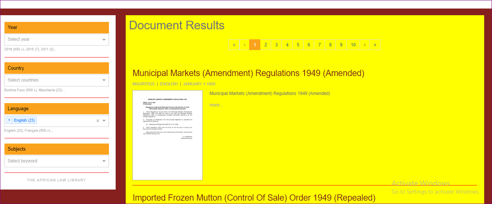

.. raw:: html

              </td>
      </tr>

      <tr>
          <td style="border: 1px solid black; text-align:center;">--content-doc-download-border-color</td>
          <td style="border: 1px solid black; text-align:center;">Styles the border of the document actions row in the document page.</td>
          <td style="border: 1px solid black; text-align:center;">

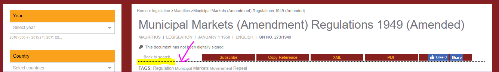

.. raw:: html

              </td>
      </tr>
          
  </table>