#################
Developing Gawati
#################

.. contents:: Table of Contents 
  :local:

************
Introduction
************

Gawati is made of different components, you don't need to install the full set to begin developing on the Gawati platform.  This section provides an outline of how you can use and individual components.

.. note::
  If you only wish to install and test the system, See :doc:`Setup <../setup/index>`.

****************
Getting Started
****************

You will need to setup the basics first.

Prepare your development environment installing and running Gawati as local services on your development system (this document provides you with additional insight).
Alternatively, use a prebuilt VM and Gawati installer to run Gawati as a virtual machine (this document gets you a standardised environment fast).

.. toctree::
   :maxdepth: 1

   dev-env-local
   dev-env-vm

********************
Development Workflow
********************

The standard development cycle is as follows:
  1. clone the projects from github
  2. build the projects where necessary (`gawati portal`_, `gawati data`_, `gawati data xml`_)
  3. deploy onto eXist-db (`gawati portal`_, `gawati data`_, `gawati data xml`_)

Code for eXist-db packages requires an additional step. You will need to export the database onto the file-system and then merge it into your github clone folder:

  .. figure:: ./_images/exist-backup.png
   :alt: eXist backup
   :align: center
   :figclass: align-center

The database contents get exported to the file system:

  .. figure:: ./_images/exist-backup-export.png
   :alt: eXist backup exported to file system
   :align: center
   :figclass: align-center

In the image the exported `gawati portal`_ folder is selected. You will need to compare this folder with the git cloned folder on your file system using a tool like `WinMerge`_(on Windows) or `Meld`_(on Linux) or `Meld OS X`_, and merge the changed files. After which you can commit your changes.

*************************
Building code from Github
*************************

We are going to look at 2 components of Gawati:
 - the Gawati-Portal component: Provides a web portal interface to Legal data on Gawati
 - the Gawati-Data component: Provides a REST API to access Gawati documents from the XML database.

The Portal accesses data and documents from the XML database via the Gawati-Data server's REST APIs.

The build process for these components is a trivial one. It merely packages the files into a format expected by eXist-db, and then the packages are deployed on eXist-db.

For example, to deploy Gawati-Data on the eXist-db server, do the following::

  https://github.com/gawati/gawati-data.git
  cd gawati-data

The source code for the Gawati-Data server is in the `gawati-data` folder, you can make code changes there.
Finally package your code::

  ant xar

This will generate a file `gawati-data-X.X.X.xar` in the `./build` folder, which you will install into eXist-db via the Dashboard.

If you have a stock installation of eXist-db, it will be running on port 8080. Access eXist-db on that port via the web-browser. Login as admin, and that should bring you to the page `http://localhost:8080/exist/apps/dashboard/index.html`. In the dashboard click on *Package Manager*:

.. figure:: ./_images/dashboard.jpg
   :alt: eXist-db dashboard
   :align: center
   :figclass: align-center

Click the *+* icon, and select the package you just built in the `build` folder and install it into eXist-db. You will find the package accessible via the URL: `eXist gawati data <http://localhost:8080/exist/apps/gawati-data>`

********************
Customizing Gawati
********************
Theming Gawati
------------------
The look and feel of Portal interface can be customized according to certain themes.  
The Portal Interface is available presently in two themes:

1. Default - `default`
2. Kenya - `ke`

A subset of the CSS styles have been extracted into CSS variables.  The variables are defined in `vars.css` files.  A `vars.css` file is available for each theme and contains the styles specific to that theme. `vars.css` and the images used in a theme are present in the `src/css/themes/<theme>` folder.  In order to apply a theme, edit the file `.env`.  Change the value of the `REACT_APP_THEME` variable to the code of the required theme. For eg., to select the Default theme, the `.env` file should read:

`REACT_APP_THEME=default`

The `env.development` file overrides the `.env` file in development mode.  In order to change the theme during development, modifying `env.development` alone will do.

The background, foreground colors for the text content in the top bar, section and footer areas , buttons and other UI controls, logos etc., are customizable.

Default theme
^^^^^^^^^^^^^^^^^^^^^
.. figure:: ./_images/theme_default.png
  :target: ./_images/theme_default.png
  :alt: Default theme
  :align: center
  :figclass: align-center

Kenya theme
^^^^^^^^^^^^^^^^^^^^^

.. _gawati portal: https://github.com/gawati/gawati-portal
.. _gawati data: https://github.com/gawati/gawati-data
.. _gawati data xml: https://github.com/gawati/gawati-data-xml
.. _gawati templates: https://github.com/gawati/gawati-templates
.. _WinMerge: http://winmerge.org/
.. _Meld: http://meldmerge.org/
.. _Meld OS X: https://yousseb.github.io/meld/

Customizable CSS properties
^^^^^^^^^^^^^^^^^^^^^^^^^^^^^

.. raw:: html

  <table style="border-collapse: collapse; border: solid 1px black;">
      
      <thead>
          <tr>
              <th style="border: 1px solid black; text-align:center;">Variable</th>
              <th style="border: 1px solid black; text-align:center;">Affected DOM</th>
              <th style="border: 1px solid black; text-align:center;">Images</th>
          </tr>
      </thead>

      <tr>
          <td style="border: 1px solid black; text-align:center;">--overrides-h-color</td>
          <td style="border: 1px solid black; text-align:center;">Font color of headings other than the branding area</td>
          <td style="border: 1px solid black; text-align:center;">

.. raw:: html

              </td>
      </tr>

      <tr>
          <td style="border: 1px solid black; text-align:center;">--font-1</td>
          <td style="border: 1px solid black; text-align:center;">General font-family excluding headings</td>
          <td style="border: 1px solid black; text-align:center;">

.. raw:: html

              </td>
      </tr>

      <tr>
          <td style="border: 1px solid black; text-align:center;">--font-2</td>
          <td style="border: 1px solid black; text-align:center;">Font family of headings including the branding area</td>
          <td style="border: 1px solid black; text-align:center;">

.. raw:: html

              </td>
      </tr>

      <tr>
          <td style="border: 1px solid black; text-align:center;">--font-3</td>
          <td style="border: 1px solid black; text-align:center;">Font family in the auto-suggest area</td>
          <td style="border: 1px solid black; text-align:center;">

.. raw:: html

              </td>
      </tr>

      <tr>
          <td style="border: 1px solid black; text-align:center;">--font-small-heading, --react-tabs-tab-font</td>
          <td style="border: 1px solid black; text-align:center;">Font family in the sidebar field headings, tabs respectively.</td>
          <td style="border: 1px solid black; text-align:center;">

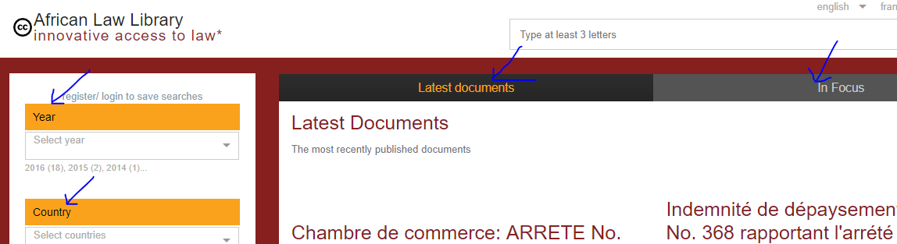

.. raw:: html

              </td>
      </tr>
      
      <tr>
          <td style="border: 1px solid black; text-align:center;">--main-col-position</td>
          <td style="border: 1px solid black; text-align:center;">Position of the main content column - left or right</td>
          <td style="border: 1px solid black; text-align:center;">

.. raw:: html

              </td>
      </tr>

      <tr>
          <td style="border: 1px solid black; text-align:center;">--content-grey-rule-bg-color</td>
          <td style="border: 1px solid black; text-align:center;">Horizontal divider line color</td>
          <td style="border: 1px solid black; text-align:center;">

.. raw:: html

              </td>
      </tr>

      <tr>
          <td style="border: 1px solid black; text-align:center;">--content-text-block-color, --content-a-hover-color</td>
          <td style="border: 1px solid black; text-align:center;">Links color and hover color</td>
          <td style="border: 1px solid black; text-align:center;">

.. raw:: html

              </td>
      </tr>

      <tr>
          <td style="border: 1px solid black; text-align:center;">--content-button-bg-color, --content-button-color</td>
          <td style="border: 1px solid black; text-align:center;">Button colors in the main content column</td>
          <td style="border: 1px solid black; text-align:center;">

.. raw:: html

              </td>
      </tr>

      <tr>
          <td style="border: 1px solid black; text-align:center;">--content-tab-pane-bg-color</td>
          <td style="border: 1px solid black; text-align:center;">Background color of the tab pane</td>
          <td style="border: 1px solid black; text-align:center;">

.. raw:: html

              </td>
      </tr>

      <tr>
          <td style="border: 1px solid black; text-align:center;">--content-search-result-bg-color, --content-search-result-box-shadow, --content-search-result-color, --content-search-result-h1-color</td>
          <td style="border: 1px solid black; text-align:center;">Styles the main content column(Figure shows the region in yellow) in the search pages.</td>
          <td style="border: 1px solid black; text-align:center;">

.. raw:: html

              </td>
      </tr>

      <tr>
          <td style="border: 1px solid black; text-align:center;">--home-wbutton-bg-color</td>
          <td style="border: 1px solid black; text-align:center;">Background color of the buttons in the header and content area</td>
          <td style="border: 1px solid black; text-align:center;">

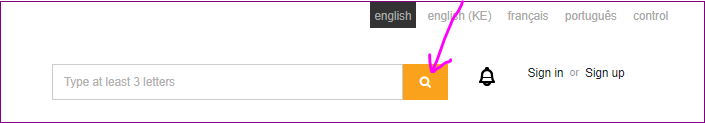

.. raw:: html

              </td>
      </tr>

      <tr>
          <td style="border: 1px solid black; text-align:center;">--footer-bg-color, --footer-color</td>
          <td style="border: 1px solid black; text-align:center;">Text and background color for region marked in red in the figure.</td>
          <td style="border: 1px solid black; text-align:center;">

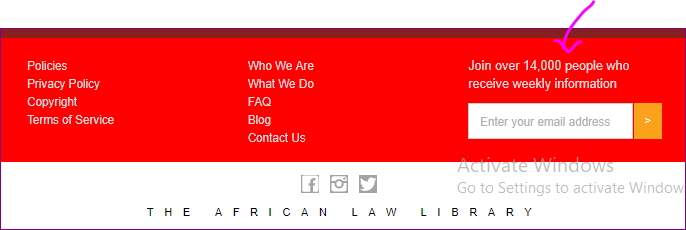

.. raw:: html

              </td>
      </tr>

      <tr>
          <td style="border: 1px solid black; text-align:center;">--footer-a-color</td>
          <td style="border: 1px solid black; text-align:center;">Text color of links(marked in red in the figure) in the footer.</td>
          <td style="border: 1px solid black; text-align:center;">

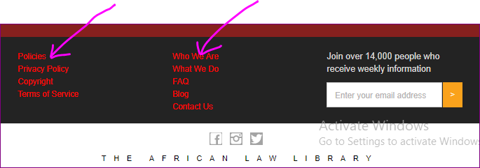

.. raw:: html

              </td>
      </tr>

      <tr>
          <td style="border: 1px solid black; text-align:center;">--footer-submit-bg, --footer-submit-color</td>
          <td style="border: 1px solid black; text-align:center;">Colors of the form button in the footer.</td>
          <td style="border: 1px solid black; text-align:center;">

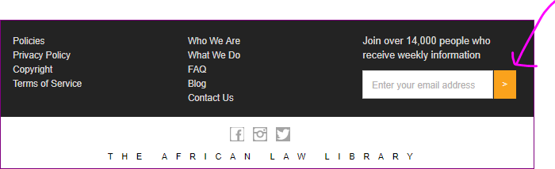

.. raw:: html

              </td>
      </tr>

      <tr>
          <td style="border: 1px solid black; text-align:center;">--footer-social-bg-color, --footer-social-color, --social-img-bg</td>
          <td style="border: 1px solid black; text-align:center;">Background, text color in the social media region of footer.</td>
          <td style="border: 1px solid black; text-align:center;">

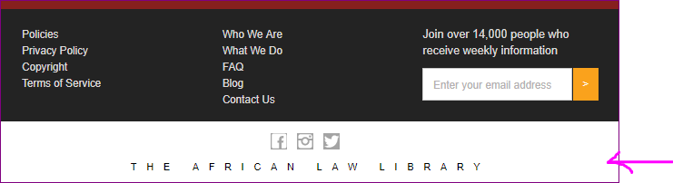

.. raw:: html

              </td>
      </tr>

      <tr>
          <td style="border: 1px solid black; text-align:center;">--pagecontentcolumn-color</td>
          <td style="border: 1px solid black; text-align:center;">Text color in the CMS pages.</td>
          <td style="border: 1px solid black; text-align:center;">

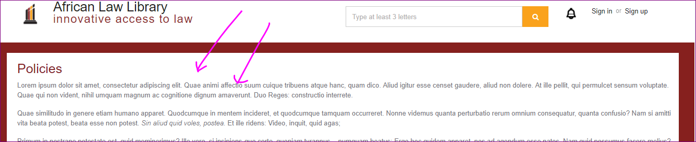

.. raw:: html

              </td>
      </tr>

      <tr>
          <td style="border: 1px solid black; text-align:center;" colspan="2">--paginator-li-bg-color: Page item background  
           --paginator-li-border-color: page item border color  
           --paginator-li-color: Page item text color 
          <td style="border: 1px solid black; text-align:center;">

.. raw:: html

              </td>
      </tr>

      <tr>
          <td style="border: 1px solid black; text-align:center;" colspan="2">
          --reacttabs-bg-color: Tab background   
          --reacttabs-color: Tab text color   
          --reacttabs-selected-bg-color: Selected tab background color  
          --reacttabs-selected-color: Selected tab text color   
          --reacttabs-border: Tab border   
          --reacttabs-border-radius: Tab border radius   
          --reacttabs-bg-image: Tab background image (separator)   
          --reacttabs-hover-bg-color: Hovered tab background color   
          --reacttabs-hover-color: Hovered tab text color  
          --reacttabs-selected-border: Selected tab border  
          --reacttab-panel-border: React tab panel border
          </td>
          <td style="border: 1px solid black; text-align:center;">

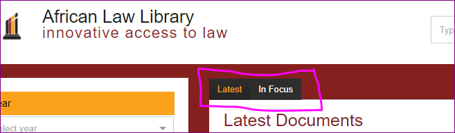

.. raw:: html

              </td>
      </tr>

      <tr>
          <td style="border: 1px solid black; text-align:center;">
          --section-bg-color, --section-color
          </td>
          <td>Background and text color of the main content and sidebar container; 
          Version text background color(shown in yellow in the figure); Background and text color of document page download links</td>
          <td style="border: 1px solid black; text-align:center;">

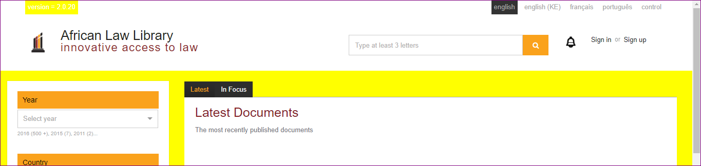

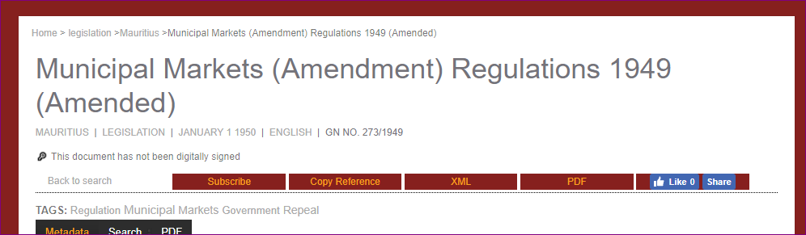

.. raw:: html

              </td>
      </tr>

      <tr>
          <td style="border: 1px solid black; text-align:center;">
          --section-flex-dir
          </td>
          <td>Determines the order of the main content and sidebar in the layout.  "row" and 
          "row-reverse" values can be used to alter the position of the main columns.</td>
          <td style="border: 1px solid black; text-align:center;">

.. raw:: html

              </td>
      </tr>

      <tr>
          <td style="border: 1px solid black; text-align:center;">
          --sidebar-col-position
          </td>
          <td colspan="2">Position of the sidebar column.  Assign values 'left' or 'right' based on the position of the main content column.    </td>
      </tr>

      <tr>
          <td style="border: 1px solid black; text-align:center;" colspan="2">
          --sidebar-bg-color - Background color of the sidebar (region in yellow in the figure) 
          --sidebar-box-shadow - Shadow of the sidebar.  
          --sidebar-border-radius - Border radius of the sidebar.
          </td>
          <td style="border: 1px solid black; text-align:center;">

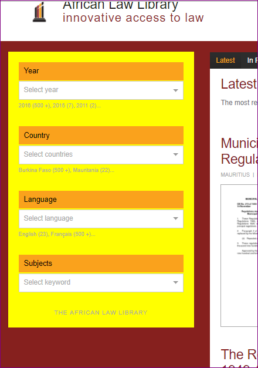

.. raw:: html

              </td>
      </tr>

      <tr>
          <td style="border: 1px solid black; text-align:center;" >
          --sidebar-a-color
          </td>
          <td> Links text color in the sidebar region
          </td>
          <td style="border: 1px solid black; text-align:center;">

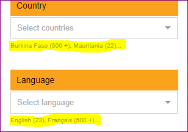

.. raw:: html

              </td>
      </tr>

      <tr>
          <td style="border: 1px solid black; text-align:center;" colspan="2">
          --sidebar-small-heading-color - Text color of the filter headings(shown in yellow in the figure) 
          --sidebar-small-heading-bg - Background color of the filter headings
          </td>
          <td style="border: 1px solid black; text-align:center;">

.. raw:: html

              </td>
      </tr>

      <tr>
          <td style="border: 1px solid black; text-align:center;" colspan="2">
          --topbar-bg - Background color of the top bar (shown in yellow in the figure) 
          --topbar-box-shadow - Shadow of the top bar. 
          <td style="border: 1px solid black; text-align:center;">

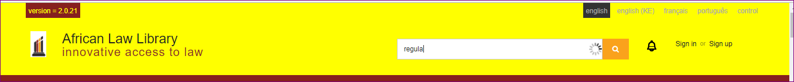

.. raw:: html

              </td>
      </tr>

      <tr>
          <td style="border: 1px solid black; text-align:center;" >
          --topbar-submit-button-bg-color
          </td >
          <td style="border: 1px solid black; text-align:center;"> Background color of the site search submit button in the top bar</td>
          <td style="border: 1px solid black; text-align:center;">

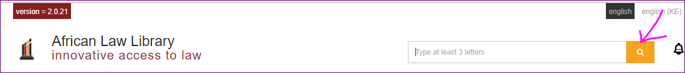

.. raw:: html

              </td>
      </tr>

      <tr>
          <td style="border: 1px solid black; text-align:center;" colspan="2">
          --logo-img-top - Brand logo in the top bar 
          --logo-img-height, --logo-img-width - Dimensions of the logo image on the topbar 
          --logo-color - Text color of the first line of heading in the branding area 
          --navbrand-top-margin - Top margin of the nav-brand.  Can align with top line of language switcher
                              or search bar.
          <td style="border: 1px solid black; text-align:center;">

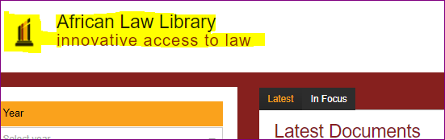

.. raw:: html

              </td>
      </tr>

      <tr>
          <td style="border: 1px solid black; text-align:center;">
          --heading-above-search --second-header-row-display
          </td>
          <td>There are two types of layouts:
            <ul>
              <li>Heading above search in a second header row</li>
              <li>Heading alongside search in the same row inside .nav-brand</li>
            </ul>
            The .logotype element containing both first and second headings is added in two places.  The display property is used to show whichever is appropriate for the layout
          <td style="border: 1px solid black; text-align:center;">

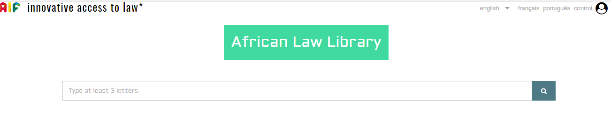

.. raw:: html

              </td>
      </tr>

      <tr>
          <td style="border: 1px solid black; text-align:center;" >
          --logotype-h1-bg  
          --logotype-h1-height 
          --logo-h1-font-size 
          --logotype-h1-lineht 
          --logotype-h1-font
          </td >
          <td style="border: 1px solid black; text-align:center;"> Styles of the first heading h1</td>
          <td style="border: 1px solid black; text-align:center;">

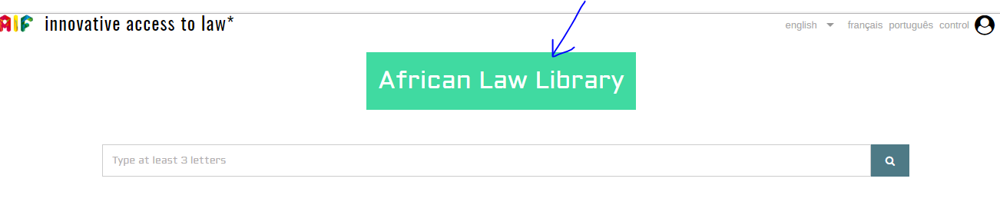

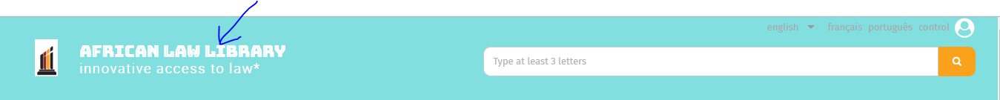

.. raw:: html

              </td>
      </tr>

      <tr>
          <td style="border: 1px solid black; text-align:center;" >
          --logo-h2-font-size 
          --logo-h2-mleft
          </td >
          <td style="border: 1px solid black; text-align:center;"> Styles of the second heading h1 - font size, left margin</td>
          <td style="border: 1px solid black; text-align:center;">

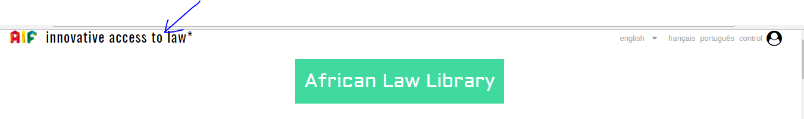

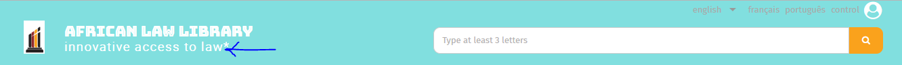

.. raw:: html

              </td>
      </tr>

      <tr>
          <td style="border: 1px solid black; text-align:center;" >
          --logo-img-float-994 
          --navbrand-mtop-994 
          --navbrand-display-994 
          </td >
          <td style="border: 1px solid black; text-align:center;" colspan="2"> Below 994px screen width, the header row is rearranged.
            The logo, and the headings are centered above the search box.

.. raw:: html

              </td>
      </tr>

      <tr>
          <td style="border: 1px solid black; text-align:center;" >
          --sidebar-left-margin-767 
          --sidebar-right-margin-767 
          --navbrand-float-767 
          </td >
          <td style="border: 1px solid black; text-align:center;" colspan="2"> Below 767px screen width, the sidebar is hidden by default.
            It can be brought up using the burger menu button.  The layout can either have the sidebar at the left or right.  So clicking 
            on the burger menu button, should bring it up from the right or left side and hide it by sliding it onto the same side.  This 
            property is used to set the side from which the sidebar swipes in and out.

.. raw:: html

              </td>
      </tr>

      <tr>
          <td style="border: 1px solid black; text-align:center;" colspan="2">
          --languageswitcher-bg-color - Background color of the language switch upon hover(red) 
          --languageswitcher-highlight-bg-color - Background color of the current language(yellow). 
          --lang-switch-font-size -Font size of text in language switcher 
          <td style="border: 1px solid black; text-align:center;">

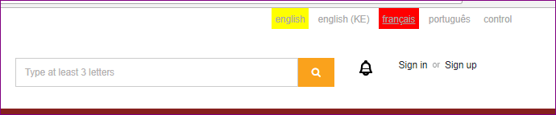

.. raw:: html

              </td>
      </tr>

      <tr>
          <td style="border: 1px solid black; text-align:center;">
          --sidebar-left-margin, --sidebar-right-margin </td>
          <td>The sidebar is collpsed by default on smaller screens and revealed using the burger menu button. Based on the
          position of the sidebar in the large screen, set left or right margin to 0px.  The sidebar is attached to the side
          with zero margin.  To which side the sidebar gets attached determines the swipe direction to close the sidebar.           
          <td style="border: 1px solid black; text-align:center;">

.. raw:: html

              </td>
      </tr>
          
  </table>