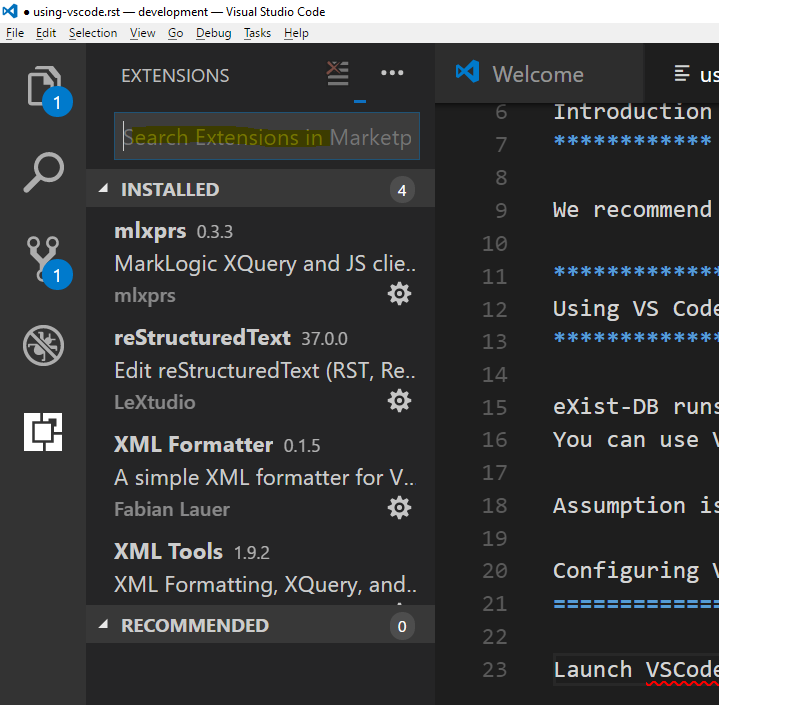
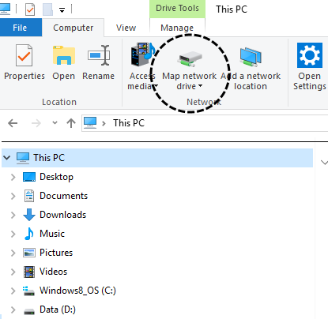
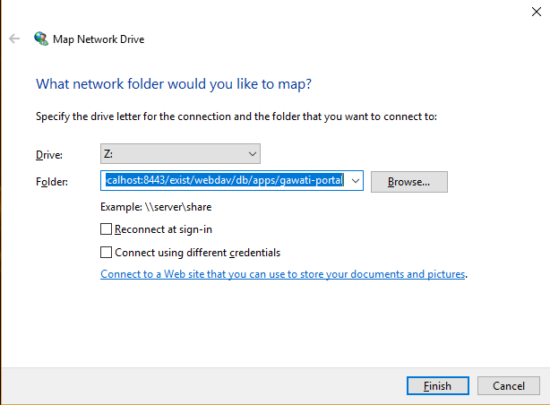
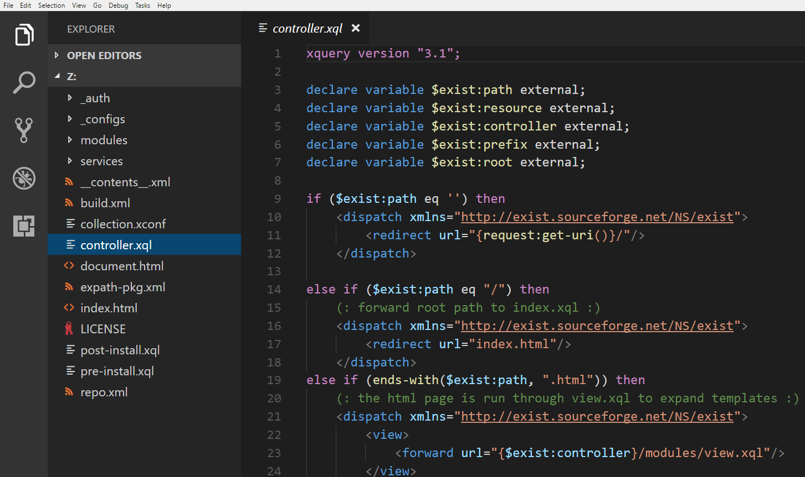

############################
Using VSCode for Development
############################

************
Introduction
************

We recommend using Visual Studio Code for Gawati Development.  It is available
as a free download (https://code.visualstudio.com/) and works on most major
OS Platforms.

*******************
Setting up defaults
*******************

Go to `File-> Preferences -> Settings`. Add / Edit entry `"files.encoding"` to
`"utf8"`. You can also set `"files.autoGuessEncoding"` to `true`.

 .. _using-vscode-existdb:

***************************
Using VS Code with eXist DB
***************************

eXist-DB runs XQuery code from within an eXist-db database collection.  You can
use VSCode to directly edit XQUery, XSLT or XML within eXist-db. Assumption is
you have installed eXist-db and VSCode on the same machine.

Configuring VSCode
==================

Launch VSCode, and then type `Ctrl+Shift+X`, and you will get the extension
marketplace search box --

Install the following plugins from there:
  * `XML Tools`
  * `XML Formatter`

You can also install other plugins that you may need for CSS / JS development.

Connecting to eXist-db via WebDav
=================================

eXist-db provides an inbuilt Web-Dav server (https://exist-db.org/exist/apps/doc/webdav.xml)
by default, this allows us to map the eXist collection as a folder.

Launch windows explorer, click on "This-PC" and then click "Map Network Drive":

You will need to connect using SSL, for example the `gawati-portal` project
installs in a collection in eXist-db with the following path: `/db/apps/gawati-portal`
to access that you will need to enter: `https://localhost:8443/exist/webdav/db/apps/gawati-portal`
(as shown below) --

Remember to check the "Reconnect at Sign-in" option, that way your network mapping
to the eXist dav folder will be persistent between reboots of your computer.

It will prompt you for a user name and password, enter the user name and password
credentials for the collection / application. For the `gawati-portal` application
for example, the default user name is `gawatiportal`. Once that is complete you
will be able to open the `Z:\` folder in VSCode, and edit the XQuery, XSLT code.

You can save, edit and create new files in the eXist collection via VSCode now.
