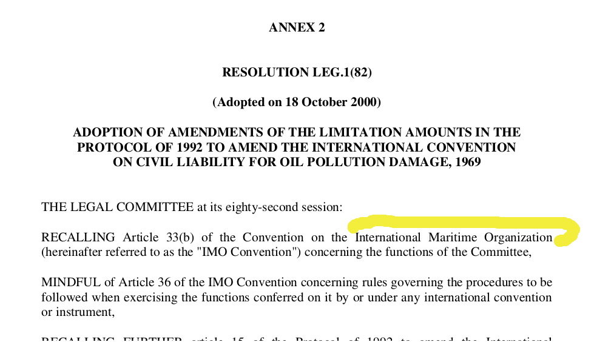

Checklist To Fix Documents
##########################

************
Introduction
************

This check-list covers checking number and country-code missing metadata in the document.

*********************
Opening the documents
*********************

Open the XML document and Open the PDF document side by side.
They follow a similar naming convention. 

 * xml file: akn_123647.xml
 * pdf file: akn_123647.pdf

**************
Items to Check
**************

================================
1 Check for Missing Country Code
================================

Look in the `<an:identification>` tags:

.. code-block:: xml
    :linenos:

    <an:identification source="#gawati">
        <an:FRBRWork>
            <an:FRBRthis value="/akn//act/2000-10-18/resolution_leg182/!main"/>
            <an:FRBRuri value="/akn//act/2000-10-18/resolution_leg182"/>
            <an:FRBRdate name="Work Date" date="2000-10-18"/>
            <an:FRBRauthor href="#author"/>
            <an:FRBRcountry value="" showAs=""/>
            <an:FRBRnumber value="resolution_leg182" showAs="RESOLUTION LEG.1(82)"/>
            <an:FRBRprescriptive value="false"/>
            <an:FRBRauthoritative value="false"/>
        </an:FRBRWork>
        <an:FRBRExpression>
            <an:FRBRthis value="/akn//act/2000-10-18/resolution_leg182/eng@/!main"/>
            <an:FRBRuri value="/akn//act/2000-10-18/resolution_leg182/eng@"/>
            <an:FRBRdate name="Expression Date" date="2000-10-18"/>
            <an:FRBRauthor href="#author"/>
            <an:FRBRlanguage language="eng"/>
        </an:FRBRExpression>
        <an:FRBRManifestation>
            <an:FRBRthis value="/akn//act/2000-10-18/resolution_leg182/eng@/!main.xml"/>
            <an:FRBRuri value="/akn//act/2000-10-18/resolution_leg182/eng@/.akn"/>
            <an:FRBRdate name="Manifestation Date" date="2015-09-23"/>
            <an:FRBRauthor href="#author"/>
            <an:FRBRformat value="xml"/>
        </an:FRBRManifestation>
    </an:identification>

Within this - check the :code:`<an:FRBRcountry>` element. 

In the above example it looks like:

.. code-block:: xml
    :linenos:

    <an:FRBRcountry value="" showAs=""/>

The :code:`@value` and :code:`@showAs` attributes are empty. ** This is an error **
These attributes are used in other elements of the :code:`<an:identification>` element, :code:`<an:references>` element and the :code:`<an:componentRef>` element.

**Within :code:`<an:FRBRWork>`:**

.. code-block:: xml
    :linenos:

    <an:FRBRWork>
	<an:FRBRthis value="/akn//act/2000-10-18/resolution_leg182/!main"/>
	<an:FRBRuri value="/akn//act/2000-10-18/resolution_leg182"/>
        ....
    </an:FRBRWork>

**Within :code:`<an:FRBRExpression>`:**

.. code-block:: xml
    :linenos:

	<an:FRBRExpression>
	    <an:FRBRthis value="/akn//act/2000-10-18/resolution_leg182/eng@/!main"/>
	    <an:FRBRuri value="/akn//act/2000-10-18/resolution_leg182/eng@"/>
            ....
	</an:FRBRExpression>

**Within :code:`<an:FRBRManifestation>`:**

.. code-block:: xml
    :linenos:

        <an:FRBRManifestation>
            <an:FRBRthis value="/akn//act/2000-10-18/resolution_leg182/eng@/!main.xml"/>
            <an:FRBRuri value="/akn//act/2000-10-18/resolution_leg182/eng@/.akn"/>
	    .....
        </an:FRBRManifestation>

**Within :code:`<an:original>`:**

.. code-block:: xml
    :linenos:

    <an:references source="#source">
        <an:original eId="original" href="/akn//act/2000-10-18/resolution_leg182/eng@/!main"
            showAs="RESOLUTION LEG.1(82)"/>
	....
    </an:references>

**Within :code:`<an:componentRef>`:** (note there are 2 attributes to set here: `@src` and `@alt` )

.. code-block:: xml
    :linenos:

    <an:componentRef src="/akn//act/2000-10-18/resolution_leg182/eng@/!main.pdf"
        alt="akn__act_2000-10-18_resolution_leg182_eng_main.pdf" GUID="#embedded-doc-1"
        showAs="ADOPTION OF AMENDMENTS OF THE LIMITATION AMOUNTS IN THE PROTOCOL OF 1992 TO AMEND THE INTERNATIONAL CONVENTION ON CIVIL LIABILITY FOR OIL POLLUTION DAMAGE, 1969"
    />

The country code should appear in the reference :code:`/akn/<<country code here >>>/act/2000-10-18....` after `/akn//`

-------------------
Fixing Country Code
-------------------

First we have to determine what is the country of origin of the document. 

Open the PDF document corresponding to the XML document. 

For the above example, the document is here:  :download:`example_law.pdf <./_static/example_law.pdf>`

Scan the document content to understand which country it is from. The above PDF upon scanning we see:

We can see that it is not from a specific country but is from an international organization *International Maritime Organization* . 

Now open the Excel sheet of country codes, provided here: :download:`countries.xls <./_static/countries.xls>`.

The excel sheet provides country code in the first column and the country name in the 2nd. 

You will find the country code for International Maritime Organization here as:

.. code-block:: none
    :linenos:

    un-imo	International Maritime Organization

Note that down and fix it in the XML in the following places:

    1. `<an:FRBRcountry value="" showAs=""/>` becomes `<an:FRBRcountry value="un-imo" showAs="International Maritime Organization"/>`
    2. `<an:FRBRthis value="/akn//act... />` becomes `<an:FRBRthis value="/akn/un-imo/act...." />`
    3. `<an:FRBRthis value="/akn//act... />` becomes `<an:FRBRthis value="/akn/un-imo/act...." />`
    4. `<an:FRBRuri value="/akn//act/2000-10-1... "/>` becomes `<an:FRBRuri value="/akn/un-imo/act/2000-10-18..."/>`
    5. `<an:original eId="original" href="/akn//act/2000-10-18..." />` becomes `<an:original eId="original" href="/akn/un-imo/act/... " />`
    6. And `<an:componentRef>` where:
    
    .. code-block:: xml
        :linenos:

        <an:componentRef src="/akn//act/2000-10-18/resolution_leg182/eng@/!main.pdf" alt="akn__act_2000-10-18_resolution_leg182_eng_main.pdf" />

    becomes:

    .. code-block:: xml
        :linenos:

        <an:componentRef src="/akn/un-imo/act/2000-10-18/resolution_leg182/eng@/!main.pdf" alt="akn_un-imo_act_2000-10-18_resolution_leg182_eng_main.pdf" />

    more precisely for `@alt`:

    `akn__act_2000-10-18_resolution_leg182_eng_main.pdf`  becomes:

    `akn_un-imo_act_2000-10-18_resolution_leg182_eng_main.pdf`
