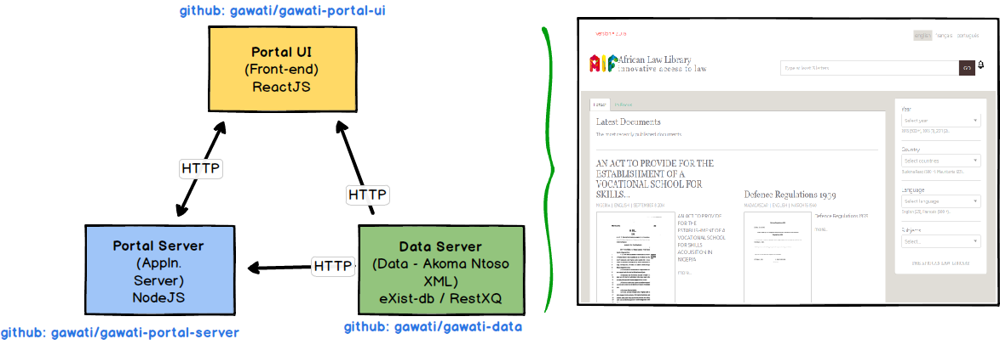

Gawati Portal 
#############

The portal is primarily three components:
    * Data Server component: Houses REST services which provide access to Akoma Ntoso (AKN) XML data, either via the AKN naming convention or via various search parameters. This back-end is written in `XQuery <https://www.w3.org/XML/Query/>`__ (see `gawati-data on github <https://github.com/gawati/gawati-data>`__ ) 
    * Application Server component - the application server does some processing (for e.g. summarization) of the legislative data to make it easier for the front-end to process large volumes of data. This is an ExpressJS server on NodeJS. (see `gawati-portal-server on github <https://github.com/gawati/gawati-portal-server>`__ ) 
    * UI Front-end: Front-end UI written in ReactJS 16.x

