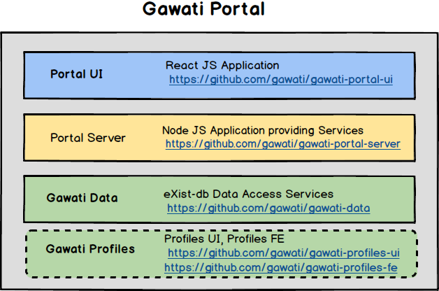

Gawati Architecture
###################

The Gawati architecture is described in this document. 

Gawati is composed of 2 different applications which have different audiences in mind. 

  1. The Gawati Portal - this is a public facing portal system that allows searching and accessing legal documents
  2. The Gawati Client - which is a back-office application that allows managing and inputting legal documents which are presented by the Portal.

*************
Gawati Portal
*************

The Gawati Portal is composed of different application components which are indicated below in the diagram. 

*************
Gawati Client
*************

The Gawati Client is composed of different application components which are indicated below in the diagram. 

.. figure:: ./_images/high-level-arch-client.png
   :alt: Gawati Portal Architecture
   :align: center
   :figclass: align-center

