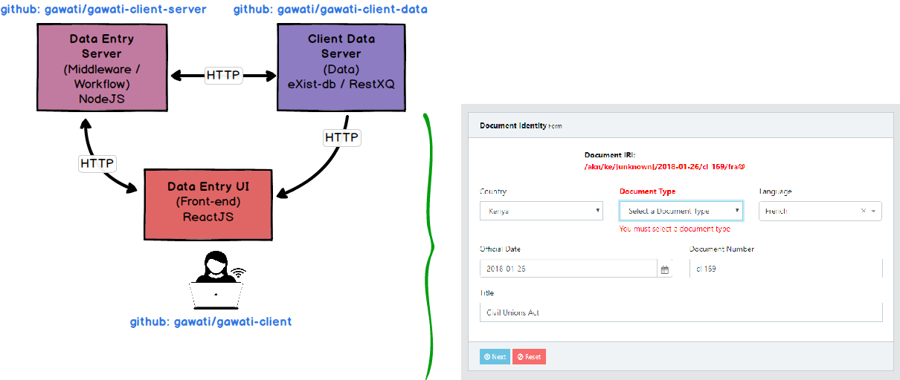

Gawati Architecture
###################

The Gawati architecture is described in this document. 

Gawati is composed of 2 different applications which have different audiences in mind. 

  1. The Gawati Portal - this is a public facing portal system that allows searching and accessing legal documents
  2. The Gawati Data Input System - which is a back-office application that allows managing and inputting legal documents which are presented by the Portal.

.. _gawati-portal:

*************
Gawati Portal
*************

The Gawati Portal is composed of different application components which are indicated below in the diagram. 

.. figure:: ./_images/high-level-arch-portal.png
   :alt: Gawati Portal Architecture
   :align: center
   :figclass: align-center

.. _gawati-editor:

********************
Gawati Editor System
********************

The Data Input System is composed of different application components which are indicated below in the diagram. 

.. figure:: ./_images/high-level-arch-client.png
   :alt: Gawati Portal Architecture
   :align: center
   :figclass: align-center

Functionally, the data input system looks like as below: 

The data entry client is composed of three components: 
    * Client Data Server component:  storage for documents being entered and run through the workflow for publication. Runs on `eXist-db` and is written in `XQuery <https://www.w3.org/XML/Query/>`__ (see `gawati-client-data on github <https://github.com/gawati/gawati-client-data>`__ ) 
    * Application Server component - this provides access to services like Workflow, Data conversion and other processing which needs to be done on the server. Runs on ExpressJS and NodeJS (see `gawati-client-server <https://github.com/gawati/gawati-client-server>`__ ) 
    * UI Front-end: this provides the data entry forms and validates user input. This a ReactJS app.

