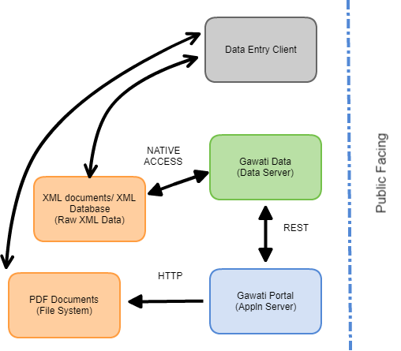

Gawati Architecture
###################

The Gawati architecture is described in this document. 

Gawati is composed of different components, which are outlined below:

 * **The Raw Data:** composed of XML and PDF documents. The XML documents reside within an XML Database.  The PDF documents are served from the file system via Apache server.
 * :doc:`**Data Server:** <./gawati-data-server>` this provides access to the XML and consequently PDF documents. It has native access to the XML data, and is accessed via REST services. Implemented as a XQuery RESTXQ Services on eXist-db. 
 * **Portal:** provides the front-end web portal to the Data Server. Currently implmented as an XQuery application on eXist-db. Front-end is bootstrap.

   Gawati Architecture
