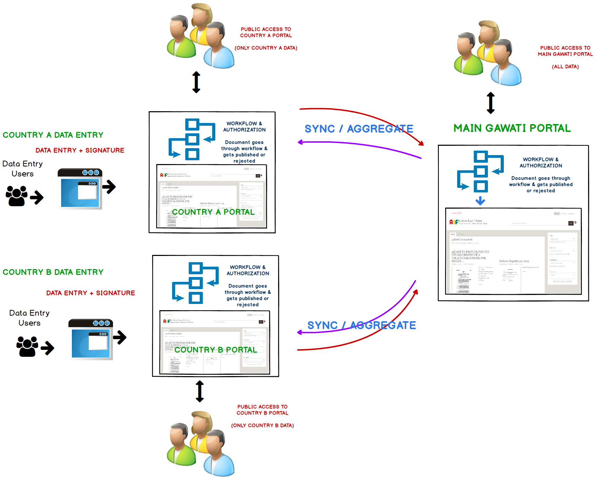
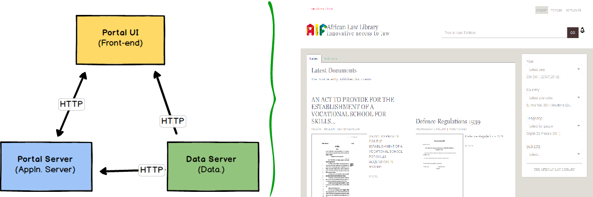
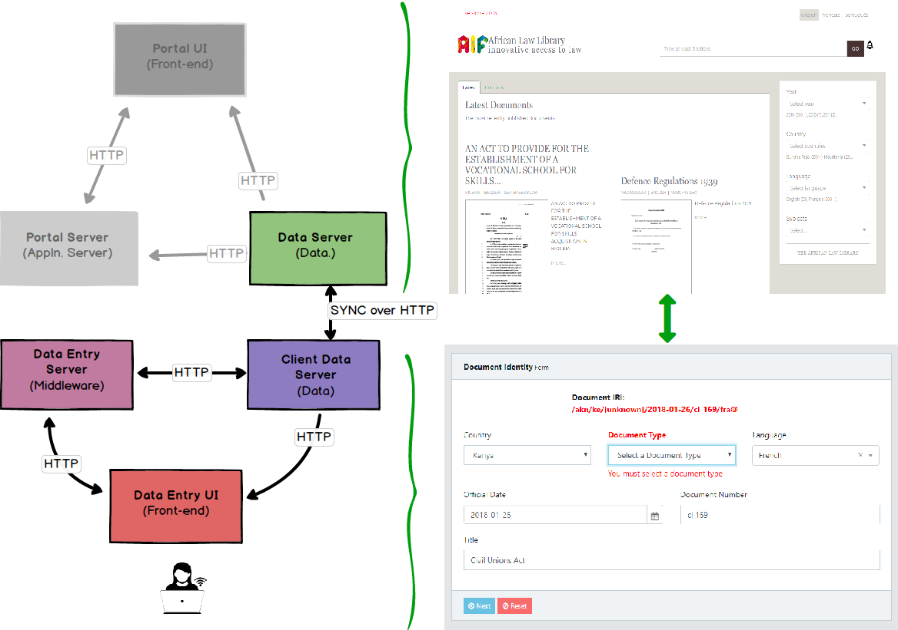

What is Gawati
##############

What is Gawati and what problem is it trying to solve ? 
=======================================================

Gawati is a Legal Data Exchange platform that allows Legal documents to be Authenticated, Shared and Published. 

If you are a custodian of legal documents, and want to publish them online, Gawati may be ideally suited to fulfil your requirements. 

Gawati lets you *own* your legal data and *authenticate* it via digital signatures, and also *control* how you want it published, while at the same time making it *searchable and accessible* using open standards. 

Conventional platforms like DSpace and Fedora Commons have very rigid formats for storing documents and are spread across various relational database tables, making it difficult to access your data in external systems, or to even migrate your data out if you want to move to a different system. 

Gawati makes us of `Akoma Ntoso XML <http://www.akomantoso.org>`__ an open standard for Legal and Legislative documents to capture all content and metadata. This allows easy portability of data if ever you want to take your data out of gawati and move to a different system. 

We do this quite differently. Our distributed / federated architecture allows syncing legal data across servers. 

You can standalone as described above, but you can also run it federated: 

Here is how Gawati works
========================

Your typical way to access Gawati would be via the online Portal - where you would search and view legal data. 

(for a more Technically oriented explanation click :doc:`here <./portal>` ) 

The Portal follows a conventional architecture which is popular nowadays of having different components which integrate via HTTP REST services. 
The portal is primarily three components:
    * Data Server component:  this serves all the Legal documents in Akoma Ntoso XML format. It provides to search and browse for legislation.
    * Application Server component - the application server does some processing (for e.g. summarization) of the legislative data to make it easier for the front-end to process large volumes of data.
    * UI Front-end: this shows the web-page being accessed by the user, and is the primary interface by which a user interacts with the system.

Adding documents to the Portal is done via a web-based Client interface, which has a similar architecture. 

.. figure:: ./_images/arch_data_entry.png
  :target: ./_images/arch_data_entry.png
  :alt: Data Entry Architecture
  :align: center
  :figclass: align-center

(for a more Technically oriented explanation click :doc:`here <./client>` )   

The data entry client is composed of three components: 
    * Client Data Server component:  this stores all the documents in AKoma Ntoso XML format. 
    * Application Server component - this provides access to services like Workflow, Data conversion and other processing which needs to be done on the server. 
    * UI Front-end: this provides the data entry forms and validates user input. 

So how does the Data entry client interface with Portal data ? 

Since it is only data that is interfaced between the data entry system and the portal, this interfacing is also done over ... HTTP !  

